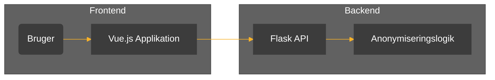

# Anonymiseringsværktøj `redact-pdf-text`
[**Formål**](#formål) | [**Beskrivelse**](#beskrivelse) | [**Afhængigheder**](#afh%C3%A6ngigheder) | [**Udvikling**](#udvikling)

## Formål

Formålet med dette projekt er at udstille en webapplikation til anonymisering af  data i PDF-dokumenter. 

Brugeren uploader en PDF-fil, vælger elementer som skal anonymiseres, og kan herefter downloade den anonymiserede fil. Applikationen kan anonymisere brugerdefineret tekst samt automatisk detektere og anonymisere CPR-numre.

## Beskrivelse

Applikationen består af en frontend bygget med Vue.js og en backend bygget med Flask.



Brugeren uploader en PDF-fil via frontend-applikationen. Filen sendes til backend-API'et, hvor PyMuPDF anvendes til at fjerne de valgte tekster. Den redigerede fil sendes derefter tilbage til brugerens klient, og kan derefter downloades. Data gemmes ikke i applikationen, men lagres midlertidigt i klientens cache.

## Afhængigheder

:gear: | Frameworks, komponenter og moduler som er del af løsningen
- Vue.js
- Flask
- PyMuPDF

:cloud: | API'er, CDN'er og andre online services som applikationen kommunikerer med
- Ingen eksterne API'er anvendes

:heavy_dollar_sign: | Miljøvariabler som forventes at være populeret
- Ingen miljøvariabler er nødvendige for denne applikation

## Udvikling

For at installere og starte løsningen lokalt eller i CodeSpace, følg disse trin:

1. Klon repository:
    ```sh
    git clone https://github.com/brugernavn/redact-pdf-text.git
    cd redact-pdf-text
    ```

2. Installer afhængigheder for frontend:
    ```sh
    cd vue
    npm install
    ```

3. Start frontend:
    ```sh
    npm run dev
    ```

4. Installer afhængigheder for backend:
    ```sh
    cd ../flask/src
    pip install -r requirements.txt
    ```

5. Start backend:
    ```sh
    python main.py
    ```

### API Endpoints

- **`POST /api/redact`**: Modtager en PDF-fil samt en liste med tekster til anonymisering. Kan modtage regex til anonymisering. Returnerer den redigerede PDF-fil.
